## Pump it up: Analyzing the water table in Tanzania

Data used in this repository comes from [_DrivenData_](https://www.drivendata.org/), an online web platform for data science practice competitions aimed at tackling social challenges. The datasets used are a compilation of data from [Taarifa](http://taarifa.org/) and the [Tanzanian Ministry of Water](http://maji.go.tz/).

The assumed business scenario for this analysis involves a client seeking to prepare for an upcoming solicitation from the World Bank to implement a program to improve access to clean water in Tanzania. The client would like to better understand the functional status of water points throughout Tanzania to inform and enhance its proposal submission. To meet the client's need I performed my analysis to determine what factors contribute to the functional status of water points in Tanzania, and where in the country there is the greatest need for water point rehabilitation.

### Overview
The data encompasses descriptive variables for 59,400 water pumps (“points”) throughout Tanzania, and was compiled by Taarifa and the Tanzanian Ministry of Water. The Taarifa platform is an open source API created during the 2012 World Bank-sponsored _Sanitation Hackathon_ used to crowd source and triage infrastructure-related social issues.

The key objective of the study is to determine **what factors contribute to the functional status of water points in Tanzania, and where rehabilitation is needed**. Key findings from the analysis include:
1. Regions in the southeast have a greater proportion of non-functional water points
2. The Department of Water Engineer (DWE) is the chief installer and village water committees (VWCs) are the predominate water point managers
3. Payment schemes work!

### Data Handling
A summary of data handling steps taken include:
- Cleaned the _installer_, _management_, and _region_ variables to more easily group values
- Joined two datasets, matching water point id codes to assign a functional condition
- Created new variables to segment by full functionality and payment scheme
- Calculated the number of years since each water point was installed, imputing the average water point age for null values
- Used Tableau to create new fields to group data for distribution analysis
- Null values generally ignored, unless otherwise stated

For additional details related to data handling, please see the [data handling report](data_handling_findings.pdf).

### Analysis
Most water points are in small communities

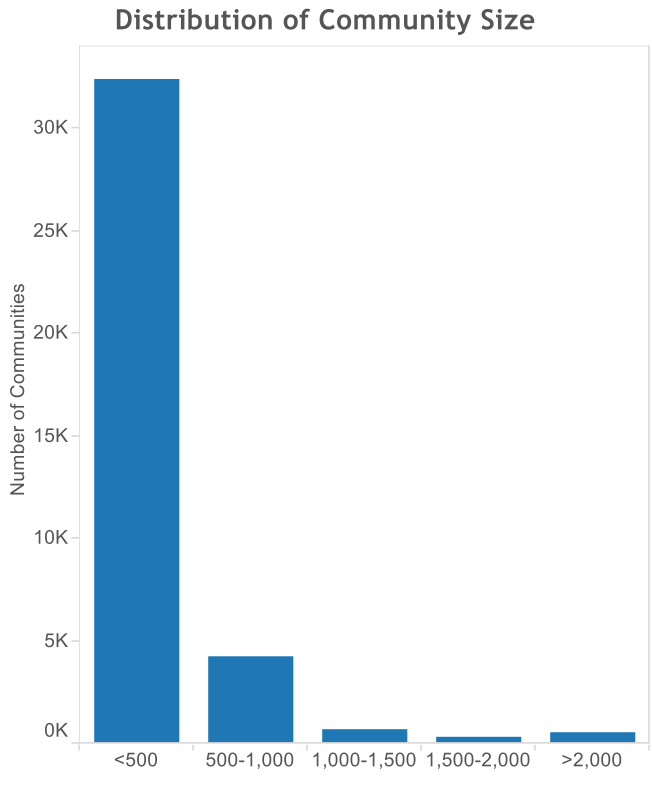

Almost half of water points are either dysfunctional or need repairs

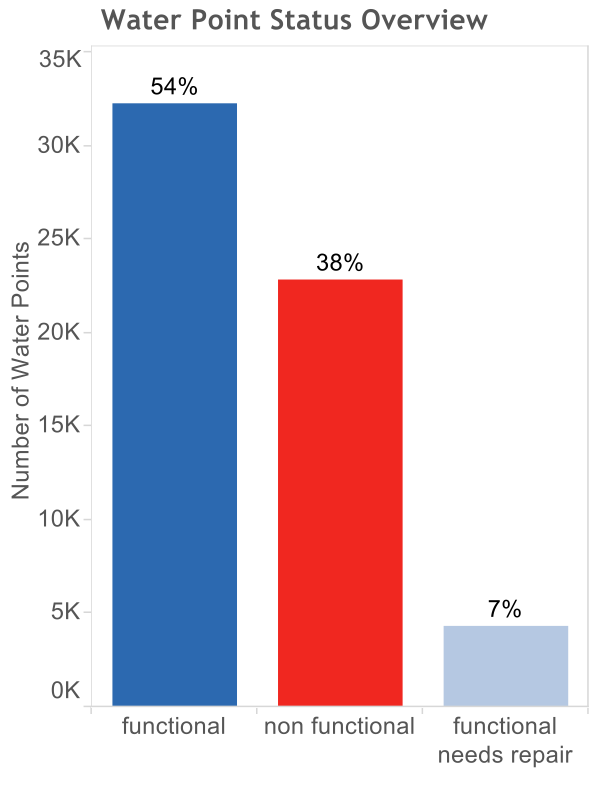

The Iringa region has the greatest number of water points, as well as the highest proportion of functional water points

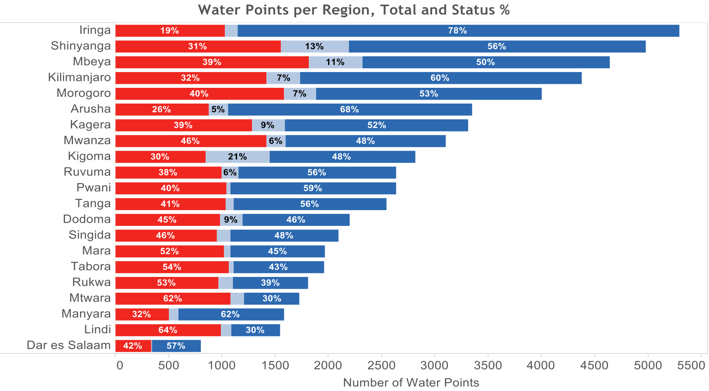

Using a region-by-region heat map, we see that two regions in the southeast (Lindi and Mtwara) exhibit a higher proportion of non-functional water pumps

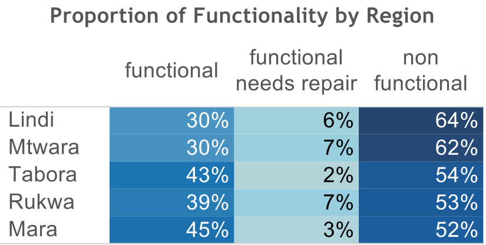

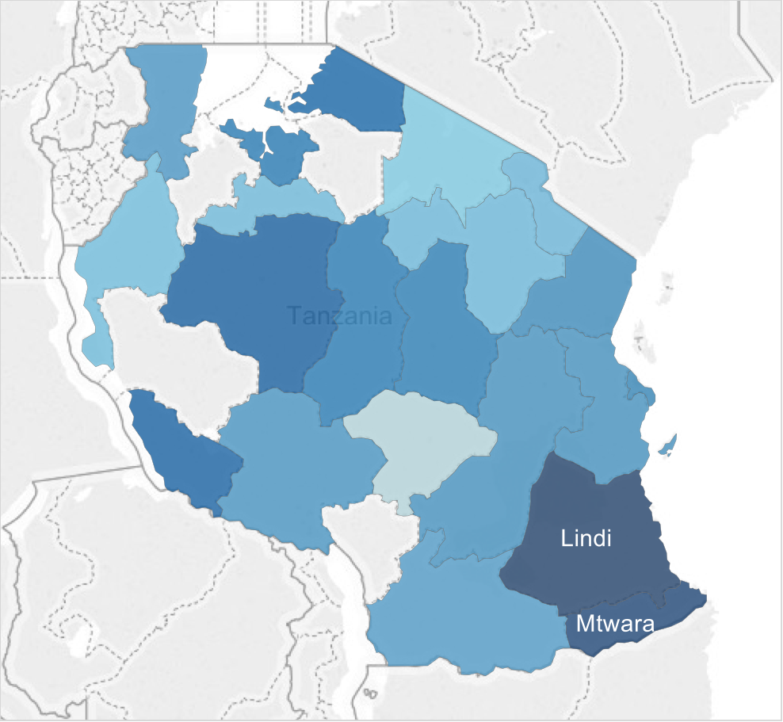

Segmenting the water points by water basin, the two Ruvuma/Southern Coast and Lake Rukwa water basins have a higher proportion of non-functional water points than fully functional water points

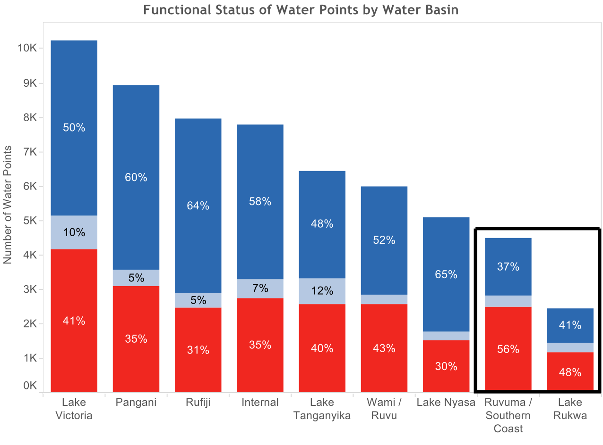

The DWE is the dominant water point installer with 30 percent of all installations, and 80 percent of Finwater-installed pumps are dysfunctional

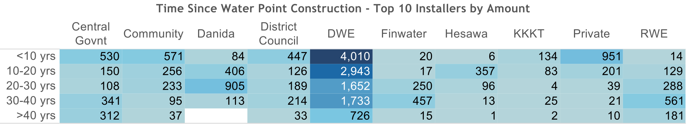

Village water committees are the predominate management structure for water pumps, however, 43 percent of all water points managed by VWCs are non-functional

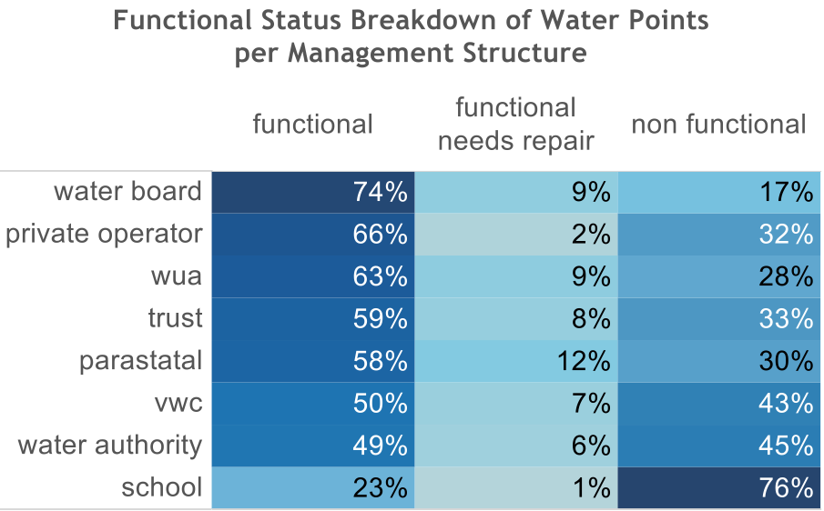

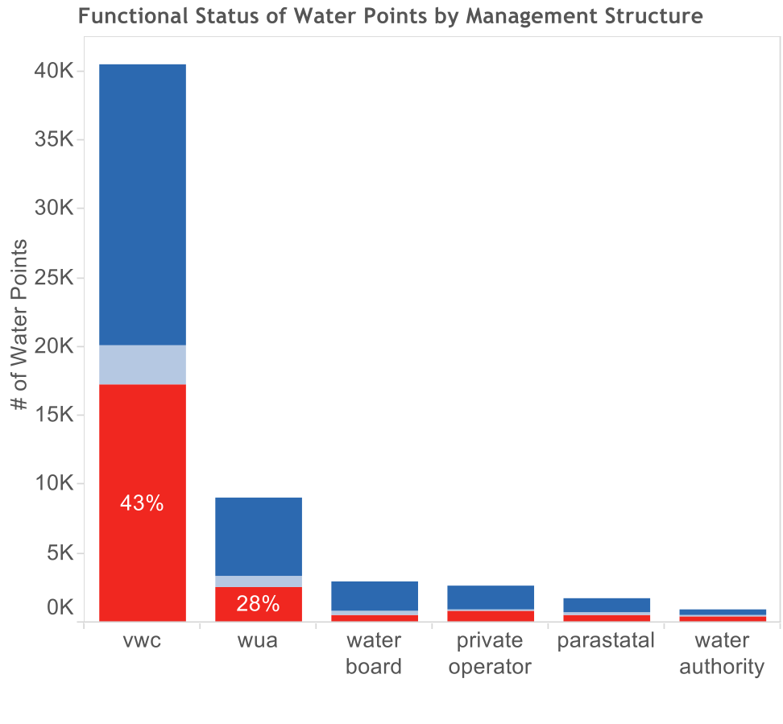

48 percent of water points without a payment scheme are non-functional, compared to only 25 percent of water points with a payment scheme being non-functional

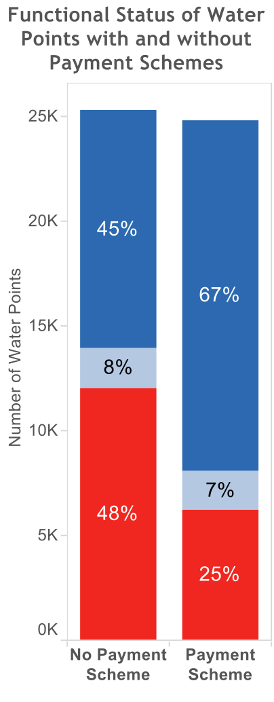
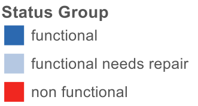

### Summary of Findings
- The Lindi and Mtwara regions along the southeast coast of the country have the greatest proportion of non-functional pumps
- The DWE is by far the most active installer in Tanzania, and the vast majority of Finwater-installed pumps are non-functional
- VWCs manage the vast majority of water points, and 43 percent of managed water points are non-functional
- Water points with a payment scheme are more likely to be functional than pumps without a payment scheme

### Recommendations and Next Steps
- A predictive model for classifying water points by functional status can be developed to enrich analysis the analysis
- Further research should be conducted into payment schemes to determine what schemes work best
- Improving the skills and capacities of the DWE will increase the sustainability and quantity of fully functional water points
- VWC should be a target stakeholder group since they manage the majority of pumps
- Understanding the social dynamics and how best to work with these groups will improve the technical proposal
- Deeper analysis into age of water points could improve predictability of functional status and likelihood of needed repairs
